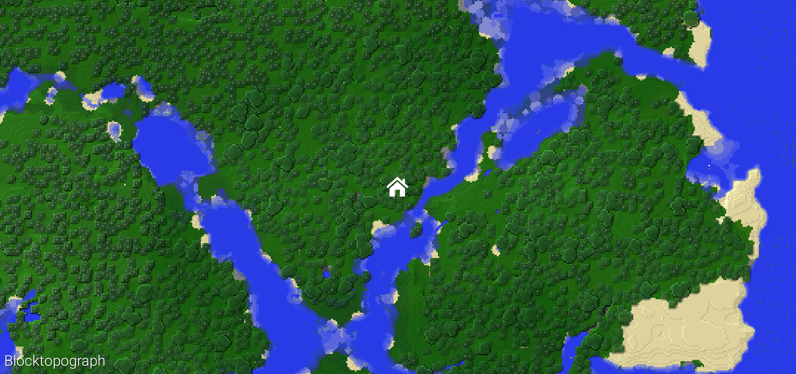
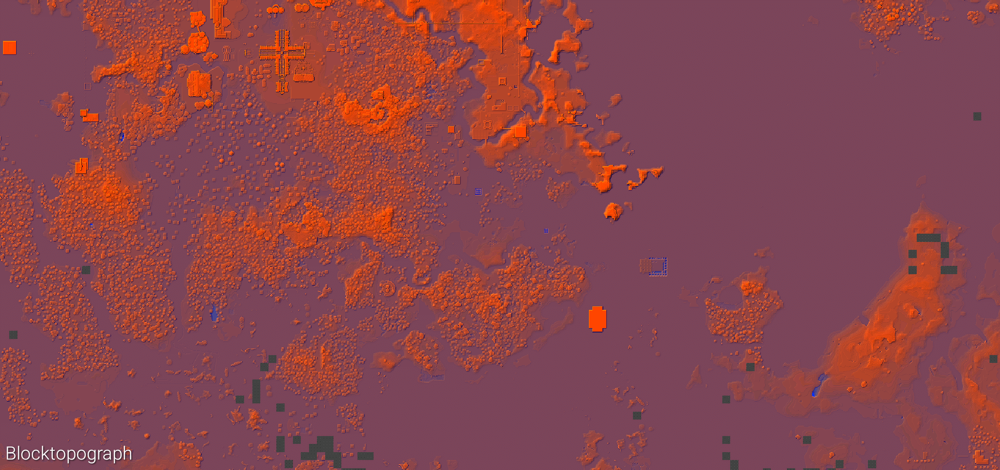
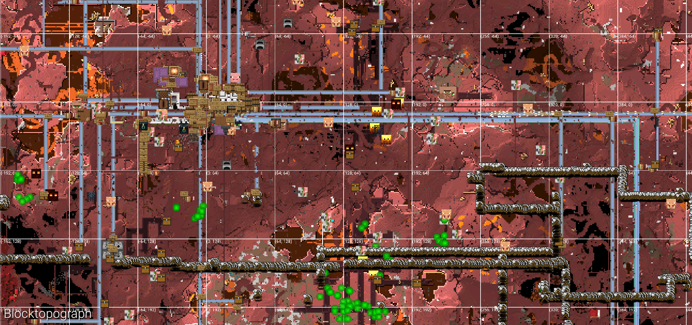
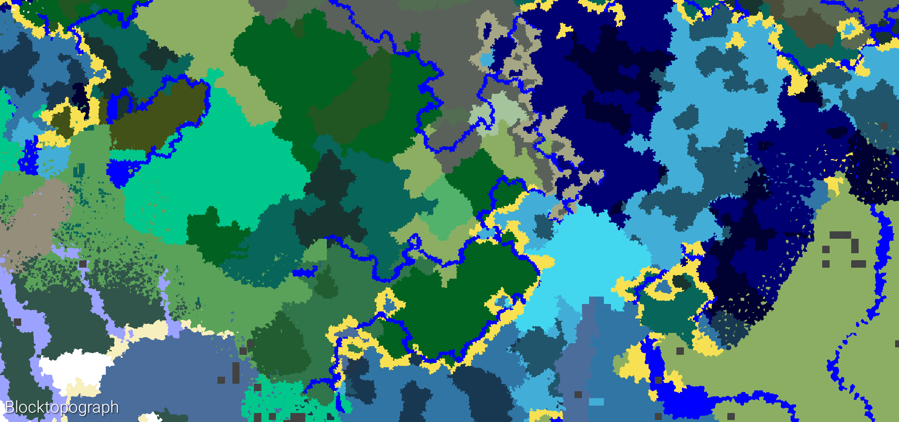

<h1 align = "center">Blocktopograph</h1>

 
 

By *Proto Lambda*\(Link removed, as he asked to\), [@MithrilMania](https://github.com/MithrilMania),
[@flagmaggot](https://github.com/flagmaggot) [@oO0oO0oO0o0o00](https://github.com/oO0oO0oO0o0o00) [@rukiroki](https://github.com/rukiroki) and many other community contributors, including translation.  
This fork is the only one supporting **MCPE 1.26.30+** for now.

## Introduction
This application is a Minecraft Bedrock Edition save‑editor for Android.

### Main Features
- Backup and restore saves.
- View satellite maps, biome maps, height maps, perspective views, caves, etc., for any version (0.14 to present) of a save, including entity and block‑entity markers.
- Replace selected blocks, delete chunks, change biomes, and more.
- Edit NBT and entities and block‑entities within chunks, and export NBT data.
- Capture the entire world’s satellite map, capture the satellite map of a selected area, and take screenshots.
- Advanced NBT editing: world NBT, single‑player/multiplayer player NBT, village NBT, export saved structures, etc.
- Create custom superflat worlds.
- And many more features.

## Roadmap
- [x] Fully restore the original functionality to be compatible with the latest version.
- [x] Add entities, block entities, and the block list up to the latest version (1.26.30).
- [x] Provide multilingual support for the majority of resources.
- [ ] Provide multilingual support for more resources.
- [x] Fix some legacy bugs.
- [x] Separate “entity tags” and “block entity tags” into two separate lists and provide individual toggles for each.
- [x] Remove the size limit of the ‘Capture Whole World Map’ feature (currently capped at 32,767 × 32,767 blocks, with any excess being clipped).
- [x] Optimized the speed of the ‘Analyze Capture Area Size’ and ‘Find Online Player List’ features (improved by several hundred times).
- [x] Add an ‘Export Structure Files Saved In‑Game’ feature and a ‘Search Keys in the Database’ feature.
- [x] Add more NBT query options in the ‘Advanced Selection’ section.
- [x] Optimize the performance of tile rendering. (boosting the rendering speed of empty‑chunk “checkerboard” tiles by hundreds of times).
- [x] Add a ‘Save to File’ feature to the NBT editor.
- [x] Optimize the UI performance of the NBT editor.
- [x] Click on the map to display the biome, elevation, and block name of the selected location.
- [ ] Generate a brightness map for the new world save (the new world save does not include a brightness map) using an algorithm.
- [ ] Add ‘Import Structure Files into World Save’ and ‘Import Custom Key‑Value Pairs into Database’ features.
- [ ] Add a ‘Horizontal Cross‑Section Preview’ feature.
- [ ] Add a ‘Vertical Cross‑Section Preview’ feature.
- [x] Add an ‘Add Custom World List Directory’ feature.
- [ ] Create a ‘Help Documentation’ website.
- [ ] A more comprehensive help documentation website.
- [ ] Implement ‘clicking an entity icon opens that entity’s NBT’.
- [ ] Export and Import Chunks.
- [ ] Paste structure files into the world terrain.
- [ ] Export any selected area as a structure file.
- [ ] Export the satellite map as HTML.
- [x] Add a storage path for the new‑version game saves so that, on some devices, the saves can be read and edited directly without manually copying them to the old‑version game’s storage directory.
- [ ] Support ‘Shizuku’ to read world saves on devices with a broader range of Android versions.
- [ ] Items inside the UI preview container.
- [ ] Add support for satellite block map textures.
- [ ] Satellite map orthographic 3D view.
- [ ] Add village range and information display.
- [ ] Hardcoded Spawning Area (HSA) region and mob‑spawn point display.
- [x] Screen (map) capture feature.

## Download
[>>> Download on GitHub Release <<<](https://github.com/rukiroki/blocktopograph/releases/latest)  

## Gallery
### Overworld satellite map.

### Height map.

### Nether map with markers and grid.

### Biome map.

## Build

Clone project in Android Studio: `File -> New -> Project from Version Control -> Git`  
Install missing SDK components. Android Studio would give you the auto-fix options.  

## LICENSE

License: **AGPL v.3**

Direct consequences: all public distributed changes in the source-code
 are required to be disclosed, including their source-code.

*Full license can be found in the [**LICENSE**](LICENSE) file in the root folder of this repository.*

NOTE: Please retain the attribution to *Proto Lambda*, the original author
 and maintainer of the official app, and later significant contributors (See [CONTRIBUTORS.md](CONTRIBUTORS.md))
 out of respect for their work towards this software.

LICENSE-head:

    Blocktopograph -- Blocktopograph is a fan-made app for MCPE, it includes a top-down world viewer and a NBT editor.
    Copyright (C) 2016 Proto Lambda

    This program is free software: you can redistribute it and/or modify
    it under the terms of the GNU Affero General Public License as published by
    the Free Software Foundation, either version 3 of the License, or
    (at your option) any later version.

    This program is distributed in the hope that it will be useful,
    but WITHOUT ANY WARRANTY; without even the implied warranty of
    MERCHANTABILITY or FITNESS FOR A PARTICULAR PURPOSE.  See the
    GNU Affero General Public License for more details.

    You should have received a copy of the GNU Affero General Public License
    along with this program.  If not, see <http://www.gnu.org/licenses/>.

## Support
For support, please open a [GitHub issue](https://github.com/rukiroki/blocktopograph/issues/new). We welcome bug reports, feature requests, and questions about using blocktopograph.

## Contributing

Always welcome! Contribute to language support.

[Help improve translation](https://github.com/oO0oO0oO0o0o00/blocktopograph/blob/master/translation.md).